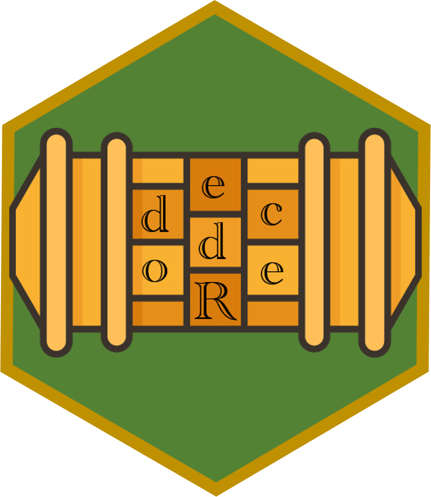

# decodeR: Gameful Activities for Introductory Programming

👋 Welcome to our repository for our eCOTS 2024 presentation! This repository contains the materials for our presentation **not** the actual decodeR package. If you are interested in the decodeR package, head on over to: <https://github.com/kbodwin/decodeR>

